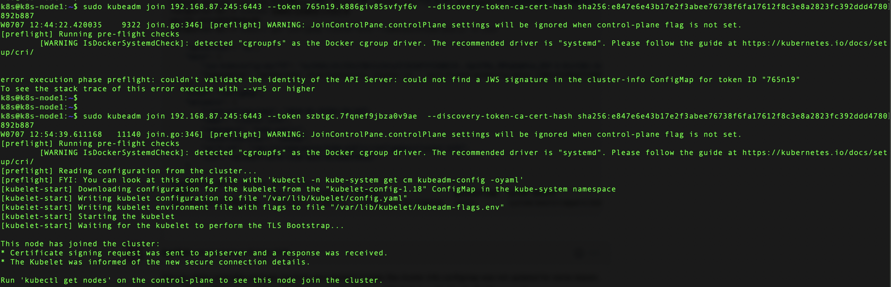
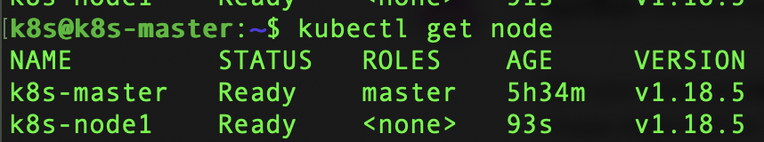

### change hostname
```bash
sudo hostnamectl set-hostname k8s-node1

```bash
### Letting iptables see bridged traffic

```bash
cat <<EOF | sudo tee /etc/sysctl.d/k8s.conf
net.bridge.bridge-nf-call-ip6tables = 1
net.bridge.bridge-nf-call-iptables = 1
EOF
sudo sysctl --system
```

### install docker
```bash
sudo apt install docker.io
sudo systemctl start docker
sudo systemctl enable docker
```
### Installing kubeadm, kubelet and kubectl
```bash
sudo apt-get update && sudo apt-get install -y apt-transport-https curl
curl -s https://packages.cloud.google.com/apt/doc/apt-key.gpg | sudo apt-key add -
cat <<EOF | sudo tee /etc/apt/sources.list.d/kubernetes.list
deb https://apt.kubernetes.io/ kubernetes-xenial main
EOF
sudo apt-get update
sudo apt-get install -y kubelet kubeadm kubectl
sudo apt-mark hold kubelet kubeadm kubectl
```


```bash
cat <<EOF | sudo tee /etc/yum.repos.d/kubernetes.repo
[kubernetes]
name=Kubernetes
baseurl=https://packages.cloud.google.com/yum/repos/kubernetes-el7-\$basearch
enabled=1
gpgcheck=1
repo_gpgcheck=1
gpgkey=https://packages.cloud.google.com/yum/doc/yum-key.gpg https://packages.cloud.google.com/yum/doc/rpm-package-key.gpg
exclude=kubelet kubeadm kubectl
EOF

# Set SELinux in permissive mode (effectively disabling it)
sudo setenforce 0
sudo sed -i 's/^SELINUX=enforcing$/SELINUX=permissive/' /etc/selinux/config

sudo yum install -y kubelet kubeadm kubectl --disableexcludes=kubernetes

sudo systemctl enable --now kubelet
```

### Disable Swap

```bash
sudo swapoff --all
sudo sed -i '/swap/d'  /etc/fstab
```
### Joining the node
```bash
k8s@k8s-master:~$ kubeadm token create --ttl 0
k8s@k8s-master:~$ sudo openssl x509 -pubkey -in /etc/kubernetes/pki/ca.crt | openssl rsa -pubin -outform der 2>/dev/null |openssl dgst -sha256 -hex | sed 's/^.* //'
k8s@k8s-node1:~$ sudo kubeadm join 192.168.87.245:6443 --token 8gtpuj.7a3m8y3dp3j5g9jo \
    --discovery-token-ca-cert-hash sha256:e847e6e43b17e2f3abee76738f6fa17612f8c3e8a2823fc392ddd4780892b88
```


### Verify Node
```bash
oc get node
```

